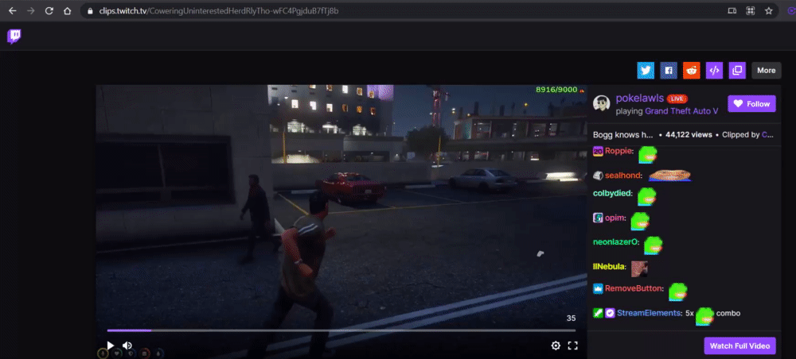

# Twitch clip/VOD sync
App that synchronises a Twitch clip/VOD to another streamers VOD if that streamer was live at the exact moment in time of the respective clip/VOD.

This app is currently a single endpoint hosted on Heroku that accepts requests. You can send a GET request to 

```
https://twitch-clip-vod-sync.herokuapp.com?url={url}&username={username}
```
where:

* {url} is the URL of the clip/VOD you are watching.
* {username} is the username of the streamer whose perspective you want to watch.

The response will look something like this:

```json
{
  "streamer": "buddha",
  "streamer_profile_image": "https://static-cdn.jtvnw.net/jtv_user_pictures/65187ee1-0ca2-447f-9477-9a08c1598603-profile_image-300x300.png",
  "vod": "https://www.twitch.tv/videos/937949172?t=1h11m34s"
}
```

## Chrome extension
This app is also available as a chrome extension. Get the extension [here](https://chrome.google.com/webstore/detail/twitch-clipvod-sync/iolfhmhipbbpacmhhffkjelgkadnffid).



## Valid clip URLs
Examples:

```
https://clips.twitch.tv/ObliqueOddCougarFunRun-GF9H5eK6aSyFbT8U
clips.twitch.tv/ObliqueOddCougarFunRun-GF9H5eK6aSyFbT8U
twitch.tv/lirik/clip/EphemeralMuddyPanPeteZarollTie-D-ojcu-Nk40osS0S
```

## Valid VOD URLs
VOD URLs must always include a timestamp with hours, minutes and seconds, even if they are 0.

Examples:

```
https://www.twitch.tv/videos/934247376?t=10h29m46s
www.twitch.tv/videos/934247376?t=0h15m12s
twitch.tv/videos/934247376?t=1h0m10s
```
